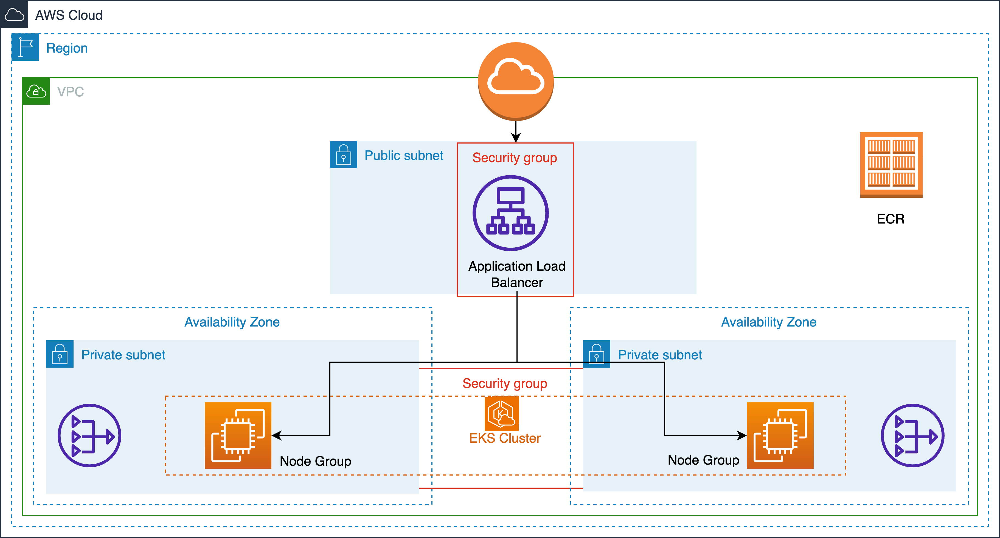

<h1 align="center">
  <br/><br/>
</h1>

# Kubernetes Cluster Setup and Deployment with '[Timeoff Management](https://github.com/timeoff-management/timeoff-management-application)' Pods

### Table of Contents

1. [Introduction](#introduction)
2. [Features](#features)
3. [Requirements](#requirements)
4. [Technology Decisions](#technology-decisions)
5. [Components](#components)
6. [Usage](#usage)

- [Clone the Repository](#clone-the-repository)
- [Test the Application](#test-the-application-locally-docker-compose)
- [Deploy with Terraform](#deploy-with-terraform)

7. [Further Additions](#further-additions)

## Introduction

This guide provides instructions on setting up an EKS cluster using Terraform and deploying a Helm chart with the [Timeoff Management](https://github.com/timeoff-management/timeoff-management-application) Application.  
The application is accessible via a URL.

## Features

- Live Application: [URL](https://timeoff.dev.morning-star.get-dev.online/)
- Application [Helm Chart](https://github.com/joeyomi/morning-star/tree/main/charts/timeoff-management-application)
- Live ArgoCD [URL](https://argocd.dev.morning-star.get-dev.online/), [Terraform](https://github.com/joeyomi/morning-star/blob/main/terraform/argo-cd.tf)
- ArgoCD Image Updater.

## Requirements

- Terraform version: `~> 1.2`
- AWS Provider version: `~> 4.0`
- Kubernetes `v1.25` or higher
- Helm `v3.x`
- Git

#### Terraform version compatibility

| Module version | Terraform version |
| -------------- | ----------------- |
| 0.x.x          | ~> 1.2            |

## Technology Decisions

| Name                    | Rationale                                   | Tradeoffs                                       | Alternatives               |
| ----------------------- | ------------------------------------------- | ----------------------------------------------- | -------------------------- |
| Helm                    | Versioning, Reproducibility                 | More complex than tools like Kustomize          | Kustomize                  |
| ALB Ingress Controller  | Integration with AWS ecosystem              | Missing advanced routing features (e.g., Istio) | Istio, Traefik             |
| Cluster Autoscaler      | Native Kubernetes support                   | Missing advanced features (e.g., Karpenter)     | Karpenter                  |
| External DNS            | Ease of Use                                 | External Dependency                             | Terraform                  |
| ArgoCD                  | Ease of Use, Familiarity                    | Additional Dependency                           | Flux                       |
| ArgoCD Image Updater    | Automation, Separation of CI from CD        | Additional Dependency                           | GitHub Actions             | 
| CloudWatch Logging      | Integration with AWS ecosystem, Familiarity | Higher costs, less flexibility                  | ELK Stack, Splunk, Graylog |
| AWS Certificate Manager | Integration with AWS ecosystem              | Limited Kubernetes ecosystem support            | CertManager                |
| ECR                     | Integration with AWS ecosystem              | Limited Kubernetes ecosystem support            | DockerHub                  |

## Components

| Name                  | Location                                                                   |
| --------------------- | -------------------------------------------------------------------------- |
| Application (code)    | `timeoff-management-application/`                                          |
| Application (helm)    | `charts/timeoff-management-application/`                                   |
| ALB Ingress Controler | `terraform/alb-controller.tf`                                              |
| Cluster Autoscaler    | `terraform/cluster-autoscaler.tf`                                          |
| External DNS          | `terraform/external-dns.tf`                                                |
| ArgoCD                | `terraform/argo-cd.tf`, https://argocd.dev.morning-star.get-dev.online/    |
| EKS                   | `terraform/eks.tf`                                                         |

## Usage

### Clone the Repository:

```bash
# Clone the repo.
git clone https://github.com/joeyomi/morning-star.git
cd morning-star
```

### Test the Application locally (docker-compose)

```bash
# `cd` into the application directory.
git submodule update --recursive --remote
cd timeoff-management-application

# Build the and run the web app.
docker build -t timeoff-management-application .
docker run -p 3000:3000 timeoff-management-application

# Generate some traffic with Apache bench.
Navigate to http://localhost:3000/
```

### Deploy with Terraform

1. Modify or comment out the remote state configurations in terraform/provider.tf.

```hcl
  backend "s3" {
    bucket         = "joeyomi-terraform-state"
    dynamodb_table = "tf-remote-state-lock"
    key            = "morning-star/terraform.tfstate"
    region         = "us-east-1"
    encrypt        = true
  }
```

2. Update variable values in terraform/varfiles/common.tfvars.

```hcl
region = "us-east-1"
prefix = "mstar"

eks_admin_users = [
  "joseph.oyomi",
]

route53_zone_id = "Z0080626S6S461RNJR1G"
```

3. Provision resources:

```bash
# `cd` into the terraform directory.
cd terraform

terraform init
terraform plan -input=false -var-file=varfiles/common.tfvars -var-file=varfiles/dev.tfvars -out=dev.tfplan
terraform apply "dev.tfplan"
```

### Install Helm Chart.

1. Update KubeConfig

```bash
aws eks update-kubeconfig --region us-east-1 --name mstar-dev-cluster
```

2. Install Helm Chart

```bash
helm repo add joeyomi https://joeyomi.github.io/morning-star/
helm install timeoff joeyomi/timeoff-management-application
```

## Further additions

- External MySQL Database
